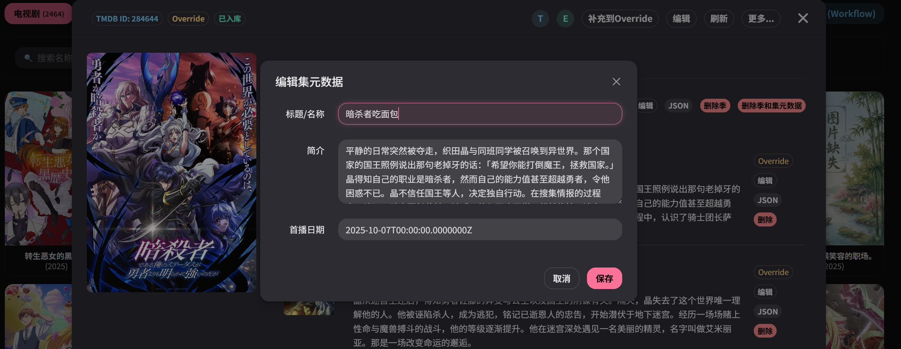
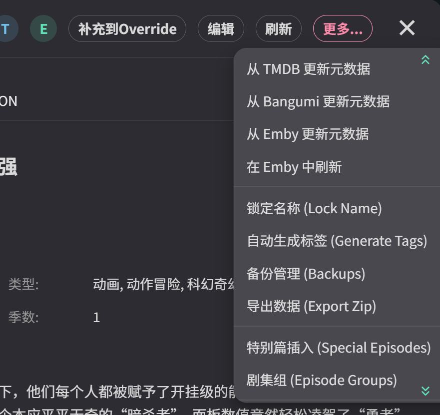

# StrmAssistant-Companion (Emby-SyTMDb-Vue3)

[](https://opensource.org/licenses/MIT)
[](https://www.docker.com/)

**StrmAssistant-Companion** 是一个专为 Emby 设计的元数据增强与封面美化工具。本项目作为 [StrmAssistant](https://github.com/sjtuross/StrmAssistant.Releases) 的强力补丁与功能扩展，旨在为追求极致体验的二次元及影视收藏爱好者提供全自动化的元数据管理方案。

> [!IMPORTANT]
> **必须配合使用**：本项目仅发布文档与功能介绍，其实际功能必须配合 [StrmAssistant.Releases](https://github.com/sjtuross/StrmAssistant.Releases) 运行，通过增强其元数据处理能力，解决动漫刮削不精准、海报样式单一等痛点。

---

## 📸 界面预览

<div align="center">
  
  <p><i>强大的自动化工作流，一键同步元数据与封面</i></p>
  <br>
  
  <p><i>多风格合集海报生成，让你的 Emby 库焕然一新</i></p>
  <br>
  
  <p><i>精细化的元数据编辑与 Bangumi 关联匹配</i></p>
</div>

---

## ✨ 核心功能

### 1. 深度整合 Bangumi 元数据
- **精准匹配**：基于 TMDB ID 自动关联 Bangumi 项目，获取最准确的番剧信息。
- **数据增强**：同步 Bangumi 的 Staff（制作人员）、角色标签、详细简介及中文标题。
- **季度修正**：自动处理复杂的动漫分季逻辑，确保 Emby 中的集数与 Bangumi 完全对应。

### 2. 艺术级封面与海报生成
- **动态封面**：内置多种设计风格（如：3D 悬浮、水墨、赛博朋克等），为媒体库生成精美的中英文封面。
- **合集海报**：支持为 Emby 合集（Collections）一键合成高颜值海报，支持自定义字体、颜色及布局。
- **高清预览**：支持生成前的多层预览，确保每一张海报都符合审美。

### 3. 进阶增强工具
- **剧集组管理**：支持自定义剧集排序与分组，解决动漫 OVA、剧场版在正片中的显示顺序问题。
- **内容分级映射**：支持自定义美国/日本等不同国家的内容分级转换规则。
- **固定名称映射**：解决部分番剧在 TMDB 上名称不符合中文阅读习惯的问题，强制锁定指定名称。

### 4. 自动化标签管理系统

- **智能规则**：根据 TMDB 类型、分级或 Bangumi 标签自动为项目添加 Emby 标签。
- **自定义预设**：支持 Emoji 标签预设，让媒体库的分级与分类一目了然。

### 4. 强大的备份与迁移
- **覆盖导出**：支持将所有手动修改的元数据导出为 ZIP，方便在不同服务器间迁移。
- **镜像快照**：支持定时的元数据与合集快照，再也不怕数据库损坏。

### 5. 无缝集成 StrmAssistant
- **原生支持**：直接处理 StrmAssistant 生成的 `.strm` 文件关联元数据。
- **Webhook 联动**：接收 Emby Webhook，在媒体入库的第一时间自动完成刮削与补全。

---

## 🛠️ 快速开始

本项目建议通过 Docker Compose 部署，推荐配置如下：

```yaml
version: '3.8'
services:
  tmdb-editor:
    image: pipi20xx/sy1024:latest
    container_name: emby-sytmdb
    ports:
      - "8121:8000"
    volumes:
      - ./data:/data                       # 数据库及配置文件存放路径
      - /vol1/1000/NVME:/vol1/1000/NVME    # 映射 StrmAssistant 的 cache/override 根目录
    environment:
      - PUID=1000                          # 运行用户的 UID
      - PGID=1000                          # 运行组的 GID
      - TZ=Asia/Shanghai
      - DATA_PATH=/data
    restart: always
```

> [!TIP]
> **关于权限**：通过设置 `PUID` 和 `PGID`，可以确保容器生成的文件与宿主机用户权限一致，避免在 NAS 或 Linux 环境下出现无法读写元数据文件的问题。

---

## 🤝 鸣谢

- [StrmAssistant](https://github.com/sjtuross/StrmAssistant.Releases) - 核心工具支持
- [Bangumi](https://bgm.tv/) - 强大的二次元元数据支持
- [TMDB](https://www.themoviedb.org/) - 影视元数据来源

---

<div align="center">
  <p>如果这个项目对你有帮助，请给 <a href="https://github.com/sjtuross/StrmAssistant.Releases">StrmAssistant</a> 点个 Star！🌟</p>
</div>
